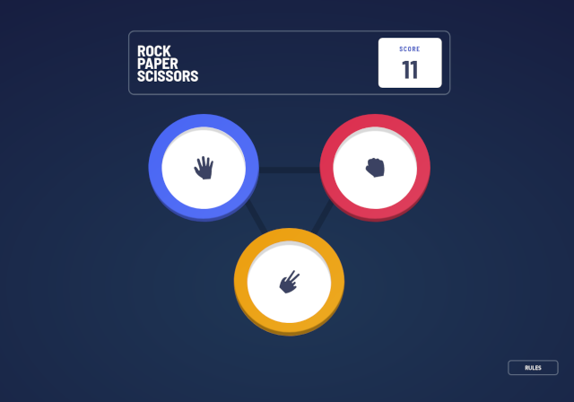
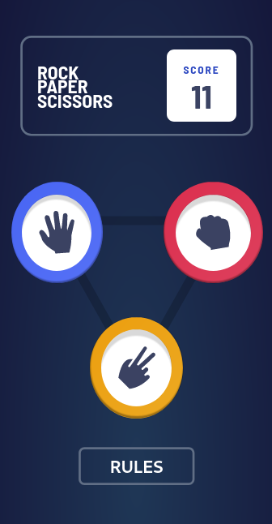

# Frontend Mentor - Rock, Paper, Scissors solution

This is a solution to the [Rock, Paper, Scissors challenge on Frontend Mentor](https://www.frontendmentor.io/challenges/rock-paper-scissors-game-pTgwgvgH). Frontend Mentor challenges help you improve your coding skills by building realistic projects.

## Table of contents

- [Overview](#overview)
  - [The challenge](#the-challenge)
  - [Screenshot](#screenshot)
  - [Links](#links)
- [My process](#my-process)
  - [Built with](#built-with)
  - [What I learned](#what-i-learned)
  - [Continued development](#continued-development)
  - [Useful resources](#useful-resources)
- [Author](#author)
- [Acknowledgments](#acknowledgments)

## Overview

I will develop a web-based Rock, Paper, Scissors game using React and Framer Motion. My goal is to create an interactive gaming experience where users can play against the computer. Points will be awarded for winning rounds and deducted for losing.

### The challenge

Users should be able to:

- View the optimal layout for the game depending on their device's screen size
- Play Rock, Paper, Scissors against the computer
- Maintain the state of the score after refreshing the browser _(optional)_
- **Bonus**: Play Rock, Paper, Scissors, Lizard, Spock against the computer _(optional)_

### Screenshot

### Links

- Solution URL: [Add solution URL here](https://your-solution-url.com)
- Live Site URL: [Add live site URL here](https://your-live-site-url.com)

## My process

Game Logic: Implement game logic to enable the computer to randomly select from available options.

Score Tracking: Display ongoing score.

Responsive Design: Optimize the game layout to adapt to different screen sizes for a consistent user experience.

Animation:Framer Motion animations.

### Built with

- Semantic HTML5 markup
- CSS custom properties
- Flexbox
- CSS Grid
- Mobile-first workflow
- [Animation Framer motion]
- [React](https://reactjs.org/) - JS library

### What I learned

Building this project allowed me to recognize the importance of structuring the UI building process, which ultimately saves time by reducing the need for bug fixes and debugging. Additionally, I learned how to effectively use Framer Motion for animations.

If you want more help with writing markdown, we'd recommend checking out [The Markdown Guide](https://www.markdownguide.org/) to learn more.

### Continued development

In future projects, I aim to further refine my understanding and implementation of UI structuring, focusing on efficient organization to minimize debugging efforts. Additionally, I plan to continue exploring and mastering Framer Motion for creating engaging animations. This includes delving deeper into animation techniques to enhance user experience and visual appeal.

### Useful resources

- [The Framer Motion Crash Course](https://www.youtube.com/watch?v=znbCa4Rr054&t=867s) - T
  The Framer Motion Crash Course video significantly aided my comprehension of Framer Motion.

## Author

<!-- - Website - [Add your name here](https://www.your-site.com)
- Frontend Mentor - [@yourusername](https://www.frontendmentor.io/profile/yourusername)
- Twitter - [@yourusername](https://www.twitter.com/yourusername) -->

## Acknowledgments
